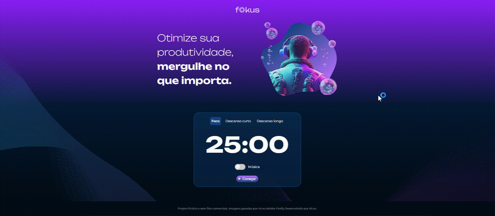

# Projeto Fokus

## Descrição do Projeto:

Este projeto foi feito durante os cursos "Manipulando Elementos DOM" e "Explorando a Manipulação de Elementos e da localStorage" da formação "Desenvolva Aplicações Web com JavaScript" da plataforma Alura.

Trata-se de um projeto Front-end baseado em dados fornecidos por uma equipe de Design através da plataforma Figma. Os código HTML e CSS também foram fornecidos, o foco principal do curso foi a prática da linguagem de programação JavaScript, principalmente a parte de manipulação de elementos.

O Fokus é inspirado na técnica do Pomodoro, que tem como finalidade o aprimoramento de atividades importantes. Basicamente consiste em focar em uma atividade durante 25 minutos ininterruptos e, após isso, um descanso curto de 5 minutos, ou um maior, de 15 minutos.

A página possui três contextos diferentes:

* Foco;
* Descanso Curto;
* Descanso Longo.

O contexto da página, assim como seus respectivos elementos, mudam de acordo com a interação do usuário, por exemplo: imagem; cor do plano de fundo; efeitos sonoros; etc.

No primeiro curso foi desenvolvida a parte referente à estilização de cada contexto da página, adição de efeitos sonoros e ajustes no botão de play/pause.

Já no segundo curso...

## :floppy_disk: Acessando o Projeto:

A versão final do projeto pode ser acessada no link abaixo:

[Projeto Fokus - Versão Final](https://projeto-fokus-zeta-one.vercel.app/)

## :computer: Tecnologias Utilizadas:

- `JavaScript`
- `HTML`
- `CSS`

> Status do projeto: :white_check_mark: Finalizado. :white_check_mark: